# 无线网络应用 笔记

- **网络接口卡NIC**：终端设备上的**网卡**，用于提供设备与网络之间的连接。
- **端口**：网络设备上的插口，网络介质通过它连接到终端设备或其它网络设备。
- **接口**：网络设备上连接到独立网络的专用端口。路由器用于互连不同的网络，**路由器**上的端口称为网络接口。

## LAN和WAN

- **局域网（LAN）**：网络覆盖区域较小，通常是由个人或单个部门拥有并管理的家庭或小型网络。
- **广域网（WAN）**：网络覆盖范围广阔，通常由**通信服务提供商（ISP）**拥有并管理。

## 家庭和小型办公室互联网连接

- **同轴电缆**：通过有线电视线路连接Internet，网络数据在有线电视电缆上进行传输。
- **DSL：数字用户线路**。通常**个人用户**会选择使用**非对称DSL（ADSL）**，特点是下载速度高于上传速度。
- **移动电话（蜂窝网**）：通过手机上网，只要能收到手机信号，就能访问Internet。
- **卫星**：对于没有Internet连接的地方来说，能获得卫星信号非常有用。卫星天线要求到卫星的视线要清晰、无遮挡。
- **拨号电话**：使用电话线和调制解调器，费用相对较低。拨号调制解调器连接提供的低带宽，通常不足以用于大型数据传输。

## 企业互联网连接

>企业通常需要**更高带宽、专用带宽和托管服务**。

- **专用租用线路（“专线”）**：租用线路是ISP为地理位置分散的办公室的保留的专用线路，提供个人语音与数据网络。专用线路通常按月或按年租用，价格较昂贵。
- **以太网WAN（城域以太网）**：以太网是一种LAN技术，现在可以将以太网的技术优势扩展应用到WAN中。（需要高速企业级电缆或光纤连接）
- **DSL**：企业DSL提供多种格式。一种常见选择是对称数字用户线路 （SDSL），它类似于DSL的普通用户版本，但是提供**相同的上传和下载速度**。
- **卫星**：当有线方案不可用时，卫星服务可以提供连接。

## 可靠网络

网络的底层架构必须具备以下四个基本特性才能满足用户的期望：

- 容错能力
- 可扩展性
- 服务质量（QoS）
- 安全

网络架构具有**容错能力**：容错网络应能够降低故障影响，使受故障影响的设备数量降至最低，并在发生故障时能够快速恢复。
**冗余**：如果一条路径失败，消息可以通过其它备份路径发送。

网络软硬件的设计开发人员遵循**统一的技术标准**，使得网络易于扩展。

**QoS**策略会对**不同类型的数据**配置不同级别的**传输优先级**。QoS是用于**管理拥塞**和确保**可靠传输数据**的一种机制。

为保障**网络基础设施安全**，一方面要保护网络设备的安全，另一方面要防止有人未经授权地访问网络设备上的管理软件。

**信息安全**是指保护网络中传输的信息和网络设备中存储的信息。

- **机密性** - 数据机密性或保密性意味着只有预定和授权收件人可访问并读取数据。
- **完整性** - 数据完整性表示保证信息在从源地址到目的地址的传输过程中，不会被更改（篡改）。
- **可用性** - 数据可用性表示授权用户能及时可靠地访问数据。

## 安全威胁

网络最常见的**外部威胁**包括：

- 病毒、蠕虫和特洛伊木马 ：恶意软件和恶意代码
- 间谍软件和广告软件：秘密收集关于用户的信息
- 零日攻击：发现系统漏洞的第一时间发起的攻击
- 黑客攻击：黑客对用户设备或网络资源发起的攻击
- 拒绝服务DoS攻击：使服务器上的“应用或服务”减缓或崩溃的攻击
- 数据拦截和盗窃：通过有线或无线网络捕获私人信息的攻击
- 身份盗窃：窃取用户的账号、密码来访问私人数据的攻击

## 安全解决方案

1、可采用的基本安全措施包括：

- 防病毒和反间谍软件 ：防止终端设备感染恶意软件。
- 防火墙过滤 ：阻止未经授权的网络访问。可以是基于主机的防火墙系统，也可以是路由器上的基本过滤服务。

2、大型网络和企业网络通常配置有更高级别的安全措施：

- 专用防火墙系统 ：提供更高级别的防火墙功能。
- 访问控制列表（ACL）：进一步过滤访问和流量转发。
- 入侵防御系统（IPS）：识别快速扩散的威胁，如零日攻击。
- 虚拟专用网络（VPN）：为远程员工提供安全访问。

## 网络协议和通信

一条计算机消息，先形成**数据包（Packet）**，然后再封装在**数据帧（Frame）**中，并通过网络发送。
**数据帧**中的地址称为**物理地址（MAC地址）**；
**数据包**中也含有“目的和源”的地址，称为**逻辑地址（IP地址）**。

- 发送主机将长消息分割为多个片段或帧。帧太长或太短都无法传送。**以太网中，帧的长度需满足：64~1518字节。**
- 每个帧都有自己的**编址信息（片段序号）**。
- 在接收主机上，消息的各个片段会依据其编址信息重新组合拼装为原始消息。

##### 3.2.1  网络协议概述（简单了解）

|      协议类型 | 描述         |
| :---------------- | ------------------- |
|网络通信协议|此类协议使设备能够在网络上进行通信。如IP、TCP、HTTP |
|网络安全协议|此类协议提供身份验证、保护数据完整性和数据加密。如安全外壳（SSH）、安全套接字层协议（SSL）等|
|服务发现协议|此类协议用于设备或服务的自动检测。如动态主机配置协议（DHCP）、域名系统（DNS）等。|

##### 3.2.2   网络协议的功能（简单了解）

消息的**发送设备**、**接收设备**以及发送路径上的所有**中转设备**都必须使用**相同的协议**。

##### 3.2.3   协议交互

下图显示了当用户向web服务器发送web页面请求时，使用的一些常见网络协议。
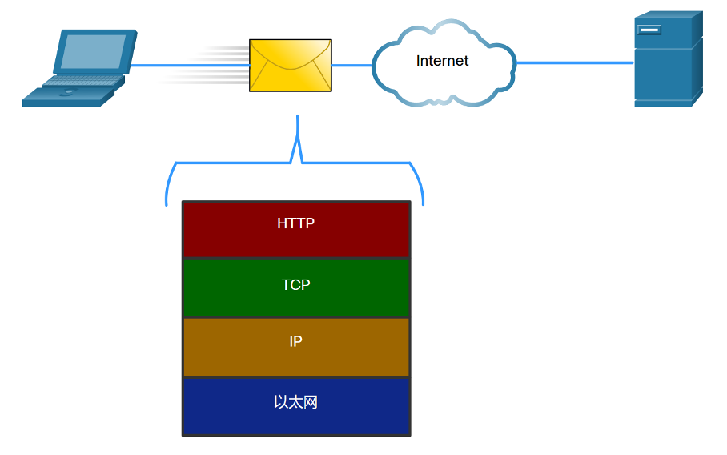

#### 3.3   协议簇

##### 3.3.1   网络协议簇

实现某种通信功能所需的一组相关协议称为**协议簇/族/栈**。
协议簇为**分层结构**，每一个上层协议都依赖于其下层协议所提供的功能。
下层协议负责**传输数据**，而上层协议则负责**处理消息**。

##### 3.3.2   协议簇的演变（简单了解）

在互联网的发展过程中，曾经出现过几个相互竞争的协议簇。
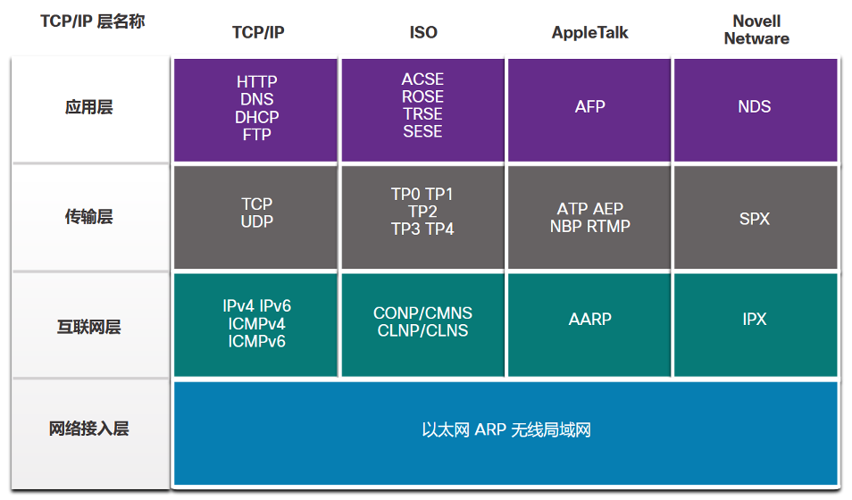

##### 3.3.3   TCP/IP协议示例

**TCP/IP协议**位于**应用层、传输层和互联网层**。
网络接入层中没有TCP/IP协议，最常见的是**以太网协议和WLAN协议**。
网络接入层协议负责通过物理介质传输 IP 数据包。
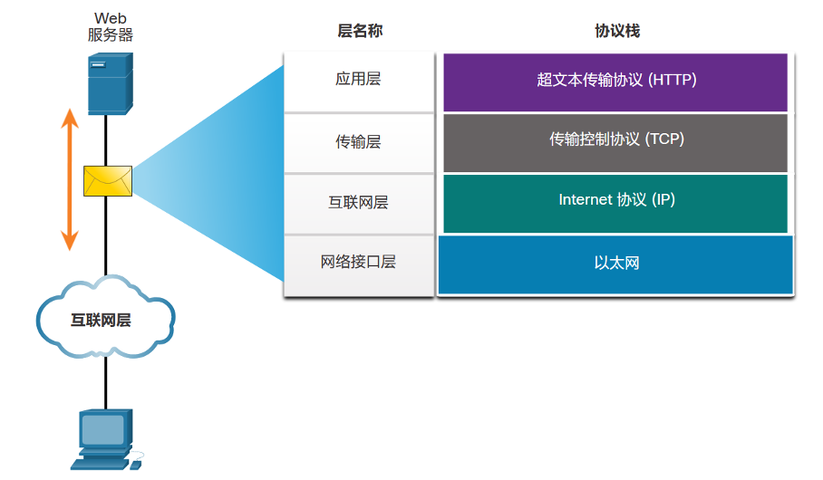
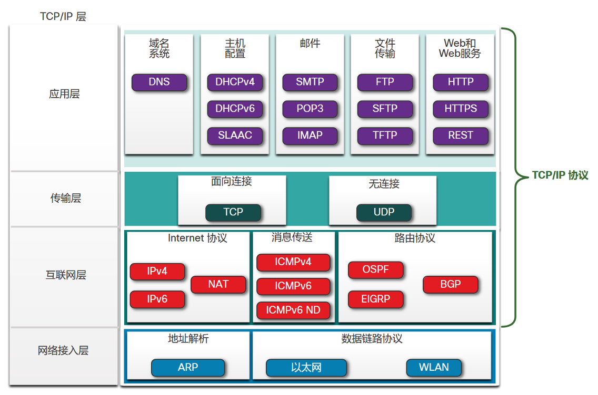

#### 3.4   标准组织

##### 3.4.1/3.4.2   开放标准/互联网标准（简单了解）

标准组织是中立于厂商的**非营利性组织**。
这些组织对管理**互联网的资源分配**、推动**互联网的技术升级**起着重要作用。
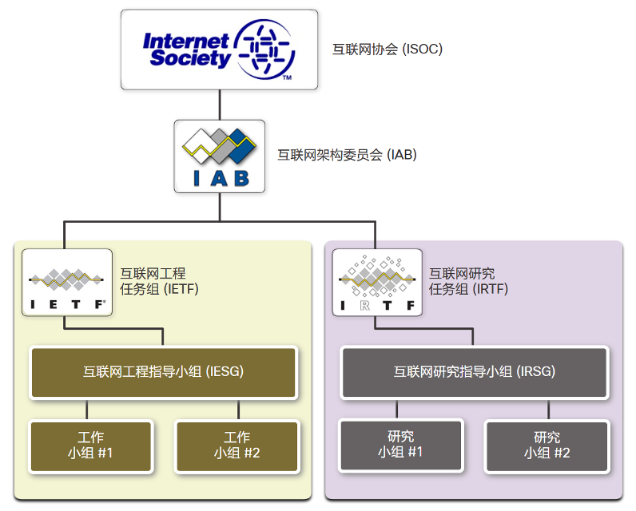
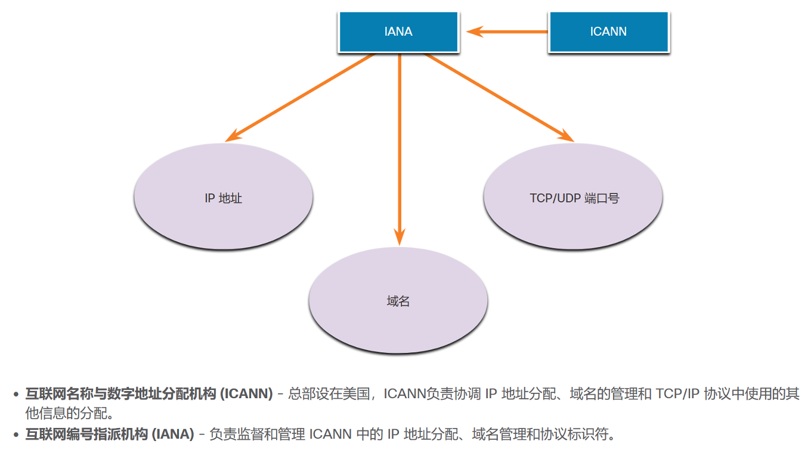

##### 3.4.3   电子和通信标准组织

**电气电子工程师协会（IEEE）**：一个工程师组织，致力于推动诸多行业领域的技术创新和标准创建，涉及的领域非常广泛，包括：电力能源、医疗保健、电信和网络等。
（IEEE 802.3 以太网，IEEE 802.11  WLAN）
**美国电子工业协会（EIA）**：设计制定用于安装网络设备的线缆、连接器等方面的标准。网线制作实验！
**电信工业协会（TIA）**：负责开发各种领域的通信标准，包括无线电设备、手机信号塔、IP语音（VoIP）设备和卫星通信等。网线制作实验！

#### 3.5   参考模型

##### 3.5.1   使用分层模型的优点

使用分层模型来描述网络协议及其工作方式，有以下优点：

- 方便了**协议设计**，因为对特定层级的协议而言，它们的**功能**以及与**上、下层级之间的接口**都已确定。
- 促进竞争，可以使用不同厂商的产品。
- 避免一个协议层级的**技术升级或功能变化**影响其它层级。
- 提供了一种描述网络功能的通用语言。

##### 3.5.2   OSI参考模型 （开放式系统互联模型）

- 应用层：与应用程序相关联的各种**通信协议**。
- 表示层：将需要传输的信息表示成规范的格式。
- 会话层：建立和维持会话。
- 传输层：添加**端口号**，封装**数据段**；规定数据的传输、重组方式、是否需要确认机制等。
- 网络层：添加**IP地址**，**封装数据包**；选择发送数据包的路径。
- 数据链路层：添加**MAC地址**，封装**数据帧**。
- 物理层：与传输介质相关，将数据转换成可以在各种介质上传输的**物理信号**。

##### 3.5.3   TCP/IP 协议模型

当我们提及TCP/IP模型的各层时，通常使用其名称；而提及OSI模型时，则通常使用其编号。
>例如，第1层指OSI模型的物理层。

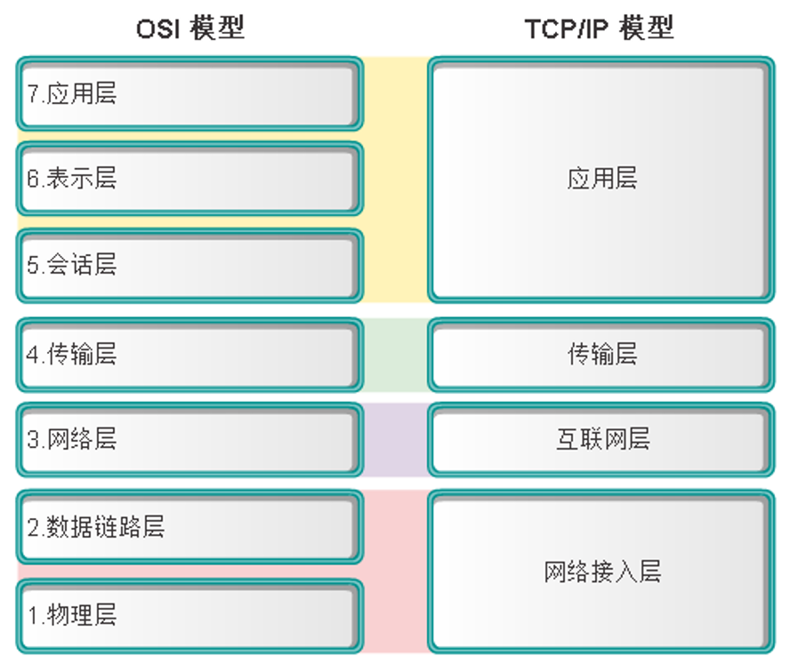

#### 3.6   数据封装

##### 3.6.1   消息分段

消息分段的两个优点：

- 可以在网络上交替发送多个不同会话，称为**多路复用**。
- 可以增强网络的**通信效率**。如果由于**网络故障或网络拥塞**，有部分消息未能传送到目的地，则**只需重新传输丢失的部分**。

##### 3.6.2   排序

**TCP协议**负责对数据段进行排序，即对每个**数据段**进行编号。

##### 3.6.3   协议数据单元

在传输数据的过程中，随着数据沿协议栈向下传递，每一层都要添加各种协议信息。此过程称为**封装**。
数据在任一协议层的表示形式称为**协议数据单元（PDU）**。
在封装过程中，每一层都从上一层接收PDU，并根据当前层协议添加新的封装。
在封装过程的每个阶段，PDU都有各自不同的名称。
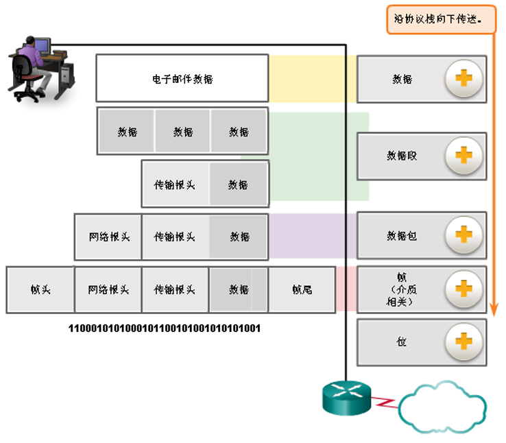

##### 3.6.4   封装示例

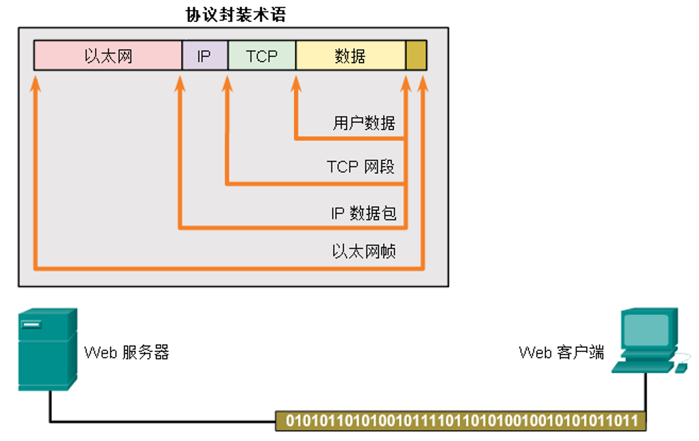

##### 3.6.5   解封示例

在解封过程中，接收设备删除一个又一个的协议报头。
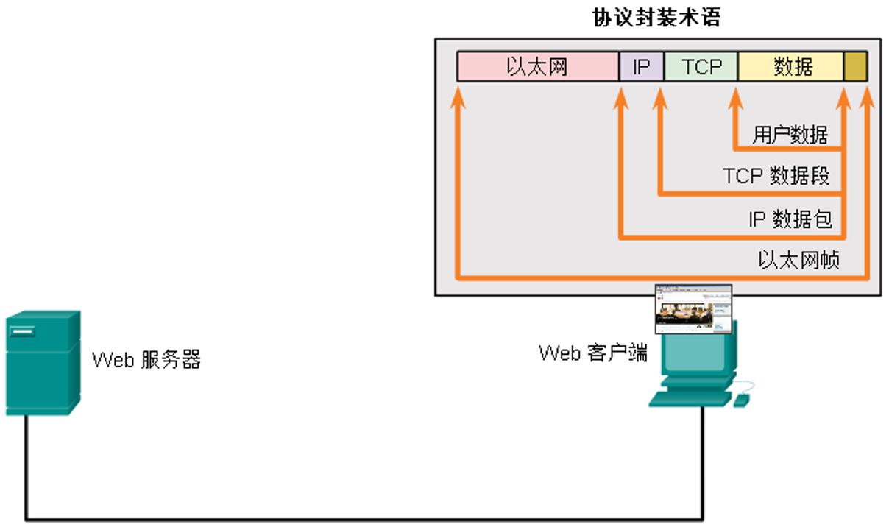

#### 3.7   数据访问

##### 3.7.2  第3层逻辑地址

数据在**跨网络传输**时，**数据包**的内容不变，即**源主机和目的主机的IP地址**不变。但是**数据帧**在经过路由器时，会被**拆封装和重新封装**，**源和目的的MAC地址**会不断变化。

##### 3.7.8   数据链路层地址

**数据链路层**的MAC地址仅用于在b中传输数据。当数据包从**发送主机到接收主机**进行传输时，沿途中的每个路由器都会将**数据包重新封装到新的数据帧**中，**每一个新的数据帧都包含新的源MAC地址和新的目的MAC地址**。
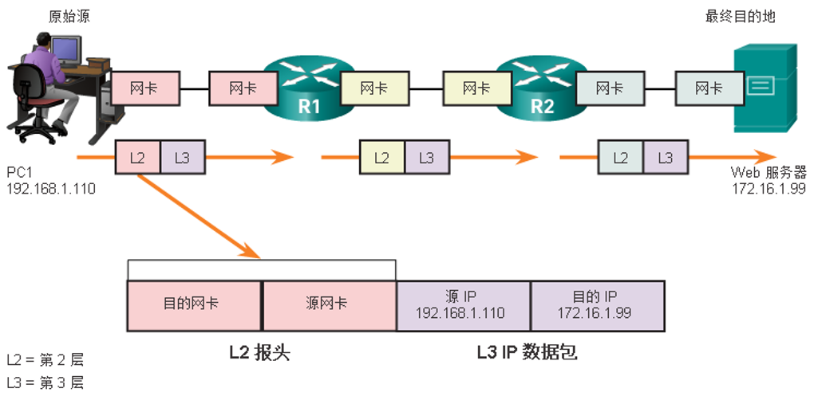
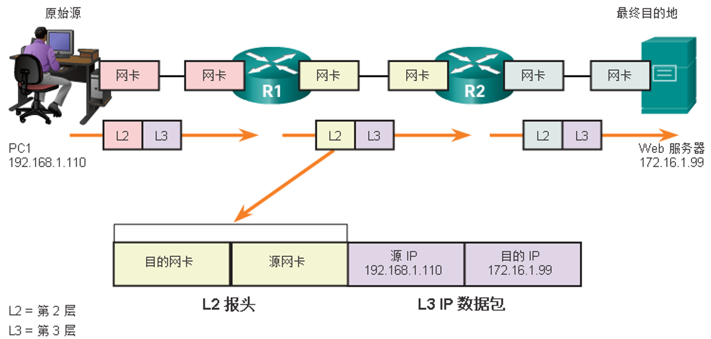
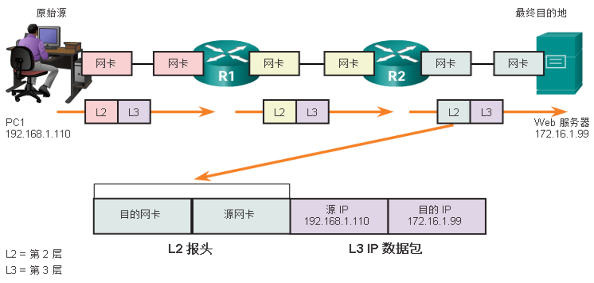

### 理论课二

#### 3.3   本地有线网络中的通信

##### 3.3.1  本地有线网络中的协议

本地有线网络中最常用的协议是**以太网（Ethernet）**。
以太网协议定义了本地网络通信的许多方面，包括：**消息格式、消息大小、时序、编码和消息模式**。
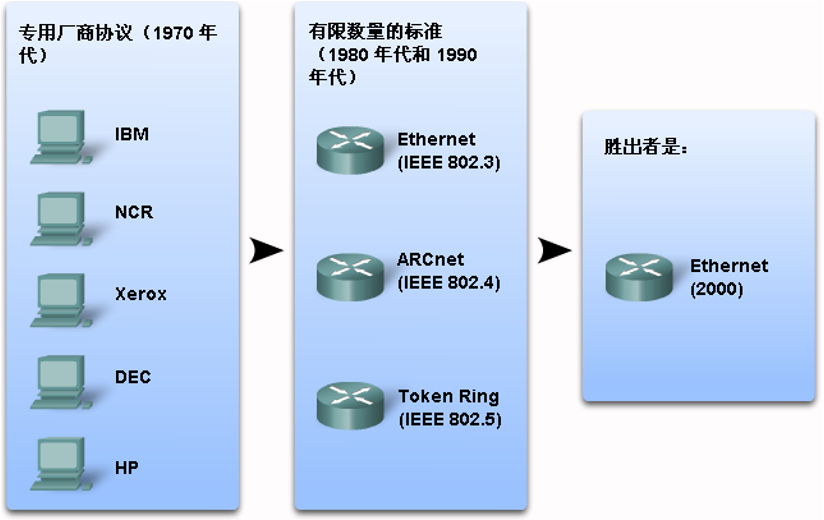

##### 3.3.3   物理寻址（重要概念！）

- 以太网中的**主机**都会有一个自己的**物理地址**，用于在网络中标识自己，相当于它的名字。
- 每个**以太网络接口**（如PC机的网卡接口）在制造时，都分配有一个**物理地址**。此地址称为**介质访问控制（MAC）地址**。该地址为**48位2进制数，6个字节（8位），12个Hex数字**。

>p.s.  ipconfig /all 命令

##### 3.3.5  以太网络的层次设计

- MAC地址表示某一主机的**独特身份**，而不指明主机在网络中的位置。如果Internet中所有主机（超过4亿台）都只用其唯一的MAC地址来标识，那么要查找一台确定的主机无异于大海捞针！
- 为帮助主机通信，以太网技术还会生成大量的**广播流量**。广播将发送到一个网络中所有主机，它非常消耗带宽，会减慢网络速度。试想如果连接Internet的所有主机都在**一个以太网络**中，且都使用广播，结果将会怎样？

由于上述两个原因，由大量主机组成的大型以太网络通常效率极低。所以最好将大型网络分割成便于管理的多个**小型网段**，这时可使用**层次设计模型**。

**接入层** - 连接本地以太网络中的主机
**分布层** - 将较小的本地网络相互连接起来
**核心层** – 在分布层设备之间高速转发大量数据
在这种层次式设计中，需要使用**逻辑寻址（IP地址**）来标识主机位置。
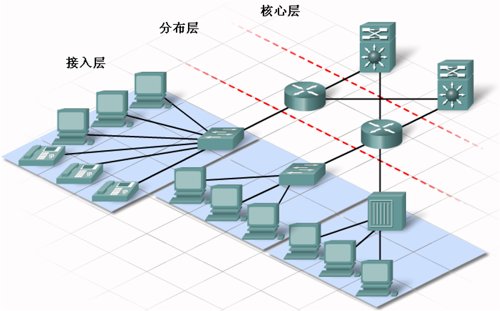

##### 3.3.6  逻辑寻址（重要概念！）

IP地址（v4）包含两部分：**32位，4个十进制数字**

- 前面的第一部分标识**本地网络**：所有连接到同一本地网络的主机，其**IP地址的网络部分**都是一样的；
- 后面的第二部分标识**特定主机**：在同一个本地网络中，**IP地址的主机部分**是每台主机所独有的。
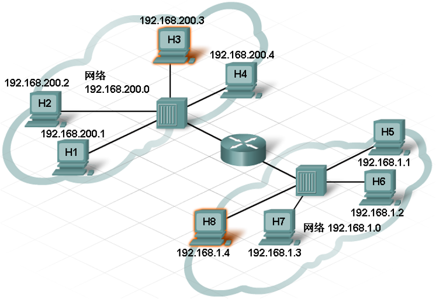

- IP地址可以用于确定：**网络通信流量**应保留在本地，还是上移到网络的更高层去进行中转。

- 若目的IP和源IP的网络部分**相同**，即二者属于**同一网络**，则保留在本地不出去。这时，源主机将消息通过**交换机**直接发送到目的主机。（**发送任务由交换机独立完成**）
- 若目的IP和源IP的网络部分**不同**，即二者属于**不同网络**，则需要上移到更高的层级去中转。这时，源主机将消息通过交换机发送到**路由器端口（默认网关**），由路由器寻找路径，将消息发送到目的主机。（**发送任务由交换机转交给路由器完成**）

>层次网络中的主机，同时需要MAC地址（固化在网卡内的地址）和IP地址；
就如同在寄信时，同时需要收信人的名字和通信地址一样。
IP地址在数据包的包头中
MAC地址在数据帧的帧头中

#### 3.4   创建以太网络的接入层

##### 3.4.1  接入层

- **接入层**是网络的最基本层级，它为用户提供连接点，用于：访问其它主机、共享文件或打印机。
- 接入层包含**主机设备**与其它相关的网络设备。
- 接入层中的每台主机使用线缆连接到网络设备，如**交换机**

##### 3.4.3   交换机的功能（重要概念！）

- **交换机Switch**是接入层的一种多端口设备。交换机可将多台主机连接到网络。**交换机可转发消息到特定主机。**
- 当一台主机发送消息到另一台主机时，交换机将接受并**解码消息帧**，以读取目的主机的**MAC地址**，然后在**MAC地址表**中找到相应端口并作出转发。

> 交换机上的MAC地址表列出了所有活动端口以及所有与这些活动端口相连主机的MAC地址。

当主机之间发送消息时，交换机将检查目的主机的MAC地址是否在MAC地址表中。

- 如果在，交换机就会在**源端口与目的端口之间创建一个临时的专用通道**，其它主机不会使用此通道。主机间的每次通信都会创建一条新的独立通道，这些专用通道使交换机上可同时进行多个通信，而不会发生冲突使数据损坏。
- 如果不在，交换机会采用“**泛洪**”处理方式，查询目的主机的MAC地址，并更新自己的MAC地址表。

##### 3.4.4   广播消息

- 在本地网络中，某台主机需要将消息同时发送到所有其它主机可以通过“**广播**”消息来实现。
- 当某台主机需要查找信息，但又不确定“哪台主机”可以提供信息时，可使用广播消息。
- 发送广播消息时需要使用一个特殊的MAC地址-**广播MAC地址**，它是一个**全部由1组成的48位地址**。鉴于其长度，MAC地址通常用十六进制表示。十六进制的广播MAC地址为**FFFF.FFFF.FFFF**，其中每个F代表二进制中的四个1（即十进制中的15）。

1. 当一台主机接收到目的地址为广播地址的消息时，它会接受并处理该消息，就像该消息是发送给它的一样。
2. 当某台主机发出一条广播消息时，交换机会将该消息转发到同一本地网络连接的每台主机。
3. 故本地网络也称为**广播域。**

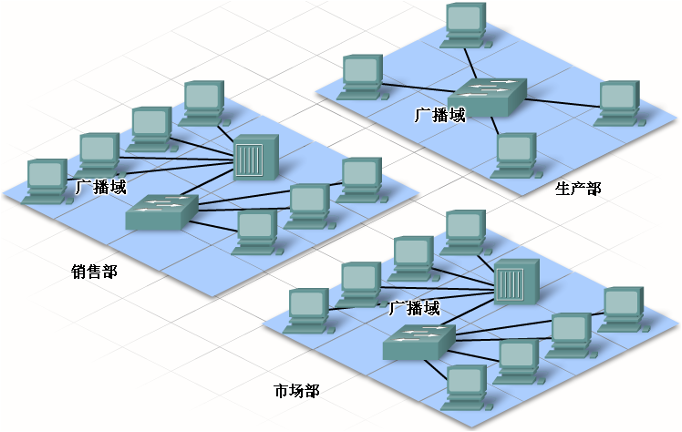

##### 3.4.6   MAC地址和IP地址

在本地网络通信中，需要两种地址：**MAC地址和IP地址**。但很多场合下，源主机只知道目的主机的IP地址，故需要一种机制用于：**根据IP地址查询MAC地址**，这种机制称为**地址解析协议（ARP）**。
**ARP：IP->MAC**
关于网络主机中的ARP表：（arp -a）

- ARP表保存了本地网络中所有主机的IP地址与MAC地址（还包括**广播地址、默认网关地址**等）
- ARP表的作用：帮助发送主机形成数据帧
- ARP表是动态更新的（通过ARP广播）

#### 3.5   创建网络的分布层

##### 3.5.1   分布层

随着网络的扩大，应将一个本地网络分成多个**接入层网络**，然后用**分布层设备**（如**路由器**）进行互联。

**路由器**在本质上是一台计算机。和计算机、平板电脑或其它智能设备一样，路由器由以下部分组成：

1. **中央处理器（CPU）**
2. **操作系统（OS）**：Cisco Internetwork Operating System（IOS）用于各种思科设备的系统软件。
3. **内存**：
   - 随机访问存储器（RAM）
   - 只读存储器（ROM）
   - 非易失性随机访问存储器（NVRAM）

路由器接口可分为两类：

- **以太网LAN接口** - 用于连接LAN设备（如计算机或交换机）。此接口也可用于路由器之间的相互连接。
- **串行WAN接口** - 将路由器连接到远程网络（地理位置较远）。

##### 3.5.2  路由器的功能（重要概念！）

**路由器Router**是一种用于**连接不同本地网络的分布层设备**。
路由器与交换机一样，都可以读取收到的消息。

- **交换机**读取的是**数据帧帧头中的MAC地址**
- **路由器**读取的是数据帧中封装的**数据包包头中的IP地址**

数据包包头中包含**目的主机和源主机的IP地址以及消息数据**。
路由器读取**目的主机IP地址的网络部分**，查找转发**到目的主机的最佳路径**/最佳路由。

>路由器如何确定发送消息到目的网络时采用的路径？
利用**路由表**！
路由器每个端口都连接到一个本地网络。每个路由器都包含一个路由表，里面有多条路由信息，每条路由列出了：
（1）**接口**
（2）通过该接口能到达的**目的网络**
（3）这条路由的**优劣信息（路由权值/度量指标/Metric）**。
**路由器使用这些信息来指导数据到达目的网络。**

**路由器的工作过程：**
当路由器收到一个**数据帧**时，会对该帧进行**解封装**，然后将**数据包**中**目的主机IP地址的网络部分**与**路由表中所有可到达的网络**作比较。

如果目的网络地址在路由表中，路由器就会将**数据包封装在一个新的帧**中，然后**将新帧从那个相应的接口转发出去**。
数据帧转发到目的网络后，再由**交换机**将其送达**目的主机**。

>路由器与广播的关系：**路由器<u>不会</u>转发广播消息**（广播消息的目的IP地址为：主机部分为全1）。

##### 3.5.3   默认网关（网关 Gateway =出口）

>必须在本地网络的每台主机上配置正确的默认网关。
如果没有在主机TCP/IP设置中配置默认网关，或者指定了错误的默认网关，便无法将消息发送到远程网络上的主机。

**默认网关**是**本地网络的出口**，要到其它外界网络去，必须先到默认网关然后再转出去。
**默认网关地址**就是**主机所在的本地网络所连接的<u>路由器接口的IP地址</u>**。
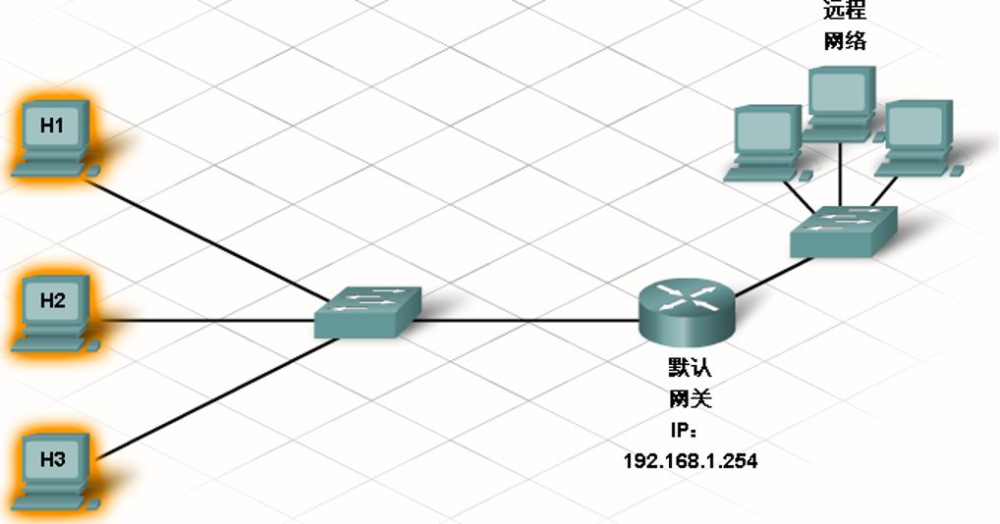
**<u>简单总结：</u>**

1. **交换机**：连接终端设备构成本地网络，负责**本地网络通信**，读取**数据帧的MAC地址**。
2. **路由器**：连接本地网络，负责**跨网络通信**，读取**数据包的IP地址**。
3. **终端设备网卡**：**形成数据帧**。
（1）**ARP表**中包含有本地网络中其它主机的“**IP地址与MAC地址对**”信息。其内容可通过 **arp –a 命令**查看。
（2）ARP表是**实时更新**的，<u>如果某台主机的信息不在其中，则会发起ARP地址解析协议进行查询</u>。
4. **本地网络通信**：发送主机根据**ARP表**中的信息，**直接形成数据帧**。
5. **远程网络通信**：发送主机将**默认网关的MAC地址**封装于**数据帧的帧头**，将**目的主机的IP地址**封装于**数据包的报头**。

### 理论课三 通过ISP连接到Internet

#### 4.2 在Internet中转发数据包（重要）

**ping命令**可用于测试源设备与目的设备之间的连通性。

